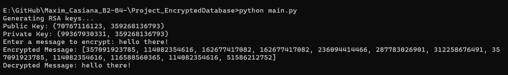

## Project Structure

- **main.py**: Entry point of the app.
- **encryption.py**: Functions for encryption/decryption of keys.
- **database.py**: Functions for database and metadata.
- **files.py**: Work with encrypted files.
- **config.py**: General configurations.

RSA 

